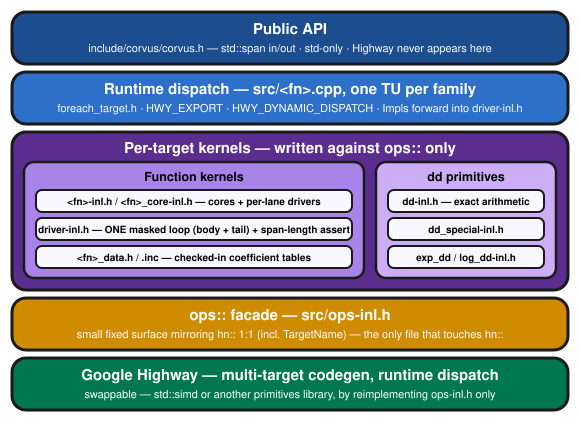

# corvus

[](https://github.com/OldCrow/corvus/actions/workflows/ci.yml)
[](https://github.com/OldCrow/corvus/releases)
[](LICENSE)

SIMD-vectorized statistical special functions for C++20, with runtime
multi-target dispatch. Fills the gap between basic-transcendental SIMD
libraries (SLEEF, Highway's contrib math) and SciPy-level special-function
coverage: erf/erfc, lgamma, regularized incomplete gamma and beta and their
inverses, and modified Bessel I0/I1 — the functions that gate vectorized
statistical CDFs, quantiles, and maximum-likelihood fitting.

**Status: early development.** `erf`, `erfc`, `lgamma`, `digamma`,
`trigamma`, `erfinv`, `erfcinv`, `gamma_p`, `gamma_q`, `gamma_p_inv`,
`gamma_q_inv`, `beta_p`, `beta_q`, `beta_p_inv`, `beta_q_inv`, `i0`,
`i1`, `i0e`, `i1e` and `lbeta` are
production-quality clean-room kernels validated against an mpmath oracle
on every SIMD tier available across the development fleet — AVX-512
(`AVX3`, `AVX3_DL`, `AVX3_ZEN4`), AVX2, SSE4, SSSE3, SSE2 and NEON, each
on native silicon (see docs/ACCURACY.md). API not yet stable.

- `erf`: max 1 ULP over the full domain.
- `erfc`: max 1 ULP for |x| <= 6 and for subnormal results; max 2 ULP in
  the tail, where what remains is the tail polynomial's fit, not the
  exponential.
- `lgamma`: max 1 ULP across the positive axis — including arbitrarily
  close to the zeros at x = 1 and x = 2, which are exact — and correctly
  rounded throughout the Stirling region. On the negative axis the bound is
  1 ULP where |lgamma| >= 1 and 2^-53 absolute below that, because lgamma
  has infinitely many zeros there with no closed form.
- `erfinv` / `erfcinv`: max 1 ULP everywhere, including subnormal results
  down to the far tail (`erfcinv` reaches x up to ~27.2; `erfinv` never
  leaves x < 6). Useful directly as the normal quantile:
  `probit(p) = -sqrt(2)*erfcinv(2p)`.
- `gamma_p` / `gamma_q` (regularized incomplete gamma): max 2 ULP on the
  directly computed (smaller) side over the whole (a, x) plane, and every
  bound is relative — the routing always computes the smaller of P/Q
  directly, so tiny values keep full relative accuracy down to (and
  through) the subnormals, including Q for arbitrarily small a.
- `beta_p` / `beta_q` (regularized incomplete beta): max 3 ULP on the
  directly computed (smaller) side over the whole (a, b, x) domain — the
  continued-fraction and gamma-limit regions are correctly rounded, the
  Temme ridge carries the 3 — with the same always-compute-the-smaller-side
  relative guarantee as the gamma pair, down to subnormal results and out
  to parameters at the ends of the double range. The reference set is
  additionally certified by an independent verification harness, and every
  target passes a monotonicity post-pass plus dense sweeps across all ten
  routing seams.

- `digamma`: max 1 ULP over the full real axis wherever |ψ| ≥ 1 —
  including arbitrarily close to the positive root x₀ ≈ 1.4616, which the
  kernel reproduces through a double-double product form despite the root
  being irrational — and 2^-53 absolute near the negative-axis zeros,
  where the reflection's terms cancel by ~49 bits and a plain-double
  assembly would keep only 3–4 correct bits.

- `trigamma`: max 1 ULP over the full real axis — correctly rounded on
  (0, 1) — under a single relative metric everywhere: ψ₁ is a sum of
  squares with no zeros on either axis, so unlike lgamma and digamma no
  absolute-error band exists, even near the reflection's poles.

- `gamma_p_inv` / `gamma_q_inv` (inverse regularized incomplete gamma —
  directly the Gamma-distribution quantile): max 1 ULP over the whole
  (a, p) domain, on both sides of the median (the solve-side switch is
  exact), with subnormal and zero results correctly rounded. Since no
  library baseline exists for the inverse, every reference row is
  individually bracket-certified: the stored answer is proven to be the
  correctly rounded inverse of its exact double input.

- `beta_p_inv` / `beta_q_inv` (inverse regularized incomplete beta —
  directly the Beta-distribution quantile): max 1 ULP over the whole
  (a, b, p) domain, with subnormal and endpoint results correctly
  rounded, and BOTH ends of [0, 1] lossless — the kernel always solves
  for whichever of x, 1−x is small, so `beta_p_inv(b, a, q)` returns
  1−x at full relative precision (SciPy's `betaincinv`, for
  comparison, degrades to ~10¹¹ ULP near 1). Where both parameters
  are tiny the quantile itself is ill-conditioned (the density is
  ~zero across the interior); there the guarantee switches to a
  backward bound — the returned x inverts a probability within 1 ulp
  of the input — which is the statistically meaningful contract, and
  the measured backward error is 0.000 ulp. Every reference row is
  individually bracket-certified, as with the gamma inverse.

- `lbeta` (ln B(a,b)): **correctly rounded on every measured row** —
  0 ULP wherever |ln B| >= 1 and half-ulp absolute in the
  ill-conditioned band around ln B's zero curve. Computed through the
  beta family's double-double lgamma-difference machinery, so the a+b
  cancellation that degrades a naive lgamma(a)+lgamma(b)-lgamma(a+b)
  assembly at large parameters is removed analytically. Positive
  finite parameters only (else NaN); saturates to -inf exactly where
  the true value leaves the double range.

- `i0` / `i1` / `i0e` / `i1e` (modified Bessel functions of the first
  kind, orders 0 and 1, plain and exponentially scaled): max 1 ULP over
  the full real axis — every function, every region, every tier, with
  no conditioning caveats. The unscaled forms saturate to ±inf exactly
  at the measured overflow boundary (|x| ≈ 713.99); the scaled forms
  stay finite to DBL_MAX and never underflow. For von Mises work:
  log I0(κ) composes as `log(i0e(x)) + x`, and A(κ) = `i1e/i0e`
  composes exactly (see docs/ACCURACY.md for the recipes, including
  stable higher-order I_j for the CDF series).

Both transcendental cores the kernels need (`exp_dd`, `log_dd`) are
corvus's own, so no accuracy-critical path depends on the backend's math
library.

## Design

- **Public API is std-only.** `std::span` in, `std::span` out. The SIMD
  backend (Google Highway) is an implementation detail hidden behind a
  ~20-op internal facade, sized so it can later be reimplemented on
  `std::simd` without touching kernel code.
- **Runtime dispatch.** One binary serves SSE2 through AVX-512 and NEON;
  the best available tier is selected at runtime.
- **Audited accuracy.** Every kernel documents its approximation source and
  accuracy bound; claims are made per SIMD tier only after validation on
  native silicon (not emulation).
- **Clean provenance.** Clean-room implementations only; MIT licensed.

The shape behind those claims — each band resting on the one below it, with
`hn::` confined to the single facade file that makes the backend swappable:



Layer-by-layer detail, and the boundary rules that are actually enforced
rather than aspirational, are in [docs/ARCHITECTURE.md](docs/ARCHITECTURE.md).

**New to the library?** [docs/USER-GUIDE.md](docs/USER-GUIDE.md) is the place
to start: what corvus does and does not provide, how to call it, and — the part
worth reading before you write anything — why a 1-ULP function does not give
you a 1-ULP result, and how to pick the right member of each function pair so
that it does.

### On performance

Accuracy is the claim here; throughput is not. corvus reaches its bounds by
carrying double-double intermediates through the hard regions, and that is
genuine extra work rather than something vectorization makes free. What
vector width buys is amortization across lanes, so any advantage grows with
the vector and is close to nothing at two lanes.

Expect the margin to vary a lot — and to depend on which libm you are
comparing against as much as on which part of the domain you are in. Measured
per-region on one machine, lgamma's best and worst bands differ by nearly a
factor of four against the same baseline. A single number for "how much faster
is it" would be hiding that spread rather than summarising it. Where the
work is genuinely harder the margin narrows, and that cost is forced by the
accuracy target rather than chosen — lgamma's Stirling switchover sits at
X0 = 8 because accuracy puts it there, not because it was tuned.

No headline speed figure is published here, deliberately. An earlier "wins from
N lanes up" formulation did not survive measurement on a second
microarchitecture, and the per-region picture currently rests on one
microarchitecture against one libm. Figures will appear in this README when it
holds on quiet-machine release builds across more than one microarchitecture,
and against more than one vendor libm — the two turn out to matter about
equally.

The measurements taken so far are written up in
[docs/PERFORMANCE.md](docs/PERFORMANCE.md), clearly marked provisional: one
machine, one compiler, one libm, and two families whose numbers do not yet
reproduce between runs. It is a working record rather than a claim, and the
tables in it are expected to change.
If throughput against your own libm on your own hardware is what decides the
question, measure it — what corvus documents, and stands behind, is the
accuracy at vector width.

## Build

```sh
cmake -B build -G Ninja -DCMAKE_BUILD_TYPE=Release
cmake --build build
ctest --test-dir build --output-on-failure
```

Uses an installed Highway if found, otherwise fetches a pinned copy at
configure time.

### Platforms and compilers

Built and tested in CI on Linux x86-64 (GCC), macOS arm64 (Apple Clang),
and Windows x86-64 (MSVC). Two Windows-specific points are worth knowing:

- **Without `-G Ninja` you get the Visual Studio generator**, which is
  multi-config: it ignores `CMAKE_BUILD_TYPE`, builds `Debug` by default,
  and needs `--config Release` to build and `-C Release` for `ctest` —
  without the latter, ctest runs no tests at all. Accuracy and performance
  claims only mean anything from an optimized build, so either pass
  `-G Ninja` as above or supply the config explicitly.
- **MSVC cannot reach AVX-512.** Highway places every AVX-512 target on its
  broken list under MSVC, so an MSVC build silently tops out at AVX2. It
  still passes every accuracy gate — the bounds hold on all tiers — but the
  widest vectors go unused. For AVX-512 on Windows, build with `clang-cl`
  (which keeps the MSVC ABI), for which there is a preset — run it from a
  Developer Command Prompt, or any shell where `vcvars64.bat` has been
  sourced:

  ```sh
  cmake --preset windows-clang-cl
  cmake --build build-clangcl
  ```

  mingw-w64 GCC is not currently safe at
  AVX2 or above: GCC 16.1 miscompiles 256- and 512-bit by-value vector
  arguments on the Windows ABI (misaligned stack temporaries — crashes
  depend on call-chain luck; GCC PR 126741, see docs/ACCURACY.md). It
  remains fine for the 128-bit tiers (SSE2/SSSE3/SSE4). Worth knowing
  that this one bites at *run* time, not build time: the build succeeds
  and the binary faults, which reads like a bug in your own code.
  `corvus::active_target()` reports the tier runtime dispatch actually
  selected, and is the only reliable way to know.

Accuracy is independent of optimization level and of compiler FP-contraction
settings: the kernels use explicit, capability-guarded FMA rather than
relying on the compiler to contract, so Debug and Release produce
bit-identical results.

> **Naming note:** Highway calls AVX-512 "AVX3" — so `HWY_AVX3`,
> `AVX3_DL`, `AVX3_ZEN4`, and `AVX3_SPR` in build output, target lists, and
> `CORVUS_DISABLED_TARGETS` values all refer to AVX-512 feature sets
> (baseline, VL/BW/DQ+VNNI, Zen 4, Sapphire Rapids), not some post-AVX2
> Intel extension of that name. `corvus::active_target()` reports these
> Highway names verbatim.

```cpp
#include <corvus/corvus.h>

std::vector<double> x = ..., y(x.size());
corvus::erf(x, y);
corvus::erfc(x, y);
corvus::lgamma(x, y);
corvus::digamma(x, y);
corvus::trigamma(x, y);
corvus::erfinv(x, y);
corvus::erfcinv(x, y);

std::vector<double> a = ..., p(a.size());  // same length as x
corvus::gamma_p(a, x, p);
corvus::gamma_q(a, x, p);
corvus::gamma_p_inv(a, p, x);              // Gamma quantile: P(a, x) = p
corvus::gamma_q_inv(a, p, x);

std::vector<double> b = ...;               // same length as a and x
corvus::beta_p(a, b, x, p);                // x in [0, 1]
corvus::beta_q(a, b, x, p);
corvus::beta_p_inv(a, b, p, x);            // Beta quantile: I_x(a,b) = p
corvus::beta_q_inv(a, b, p, x);
corvus::lbeta(a, b, p);                    // ln B(a,b), correctly rounded

corvus::i0(x, y);                          // modified Bessel I0, I1
corvus::i1(x, y);
corvus::i0e(x, y);                         // e^-|x| I0(x): full axis, no overflow
corvus::i1e(x, y);
```

Per-function methods, measured ULP bounds, and the validation matrix live
in [docs/ACCURACY.md](docs/ACCURACY.md).
