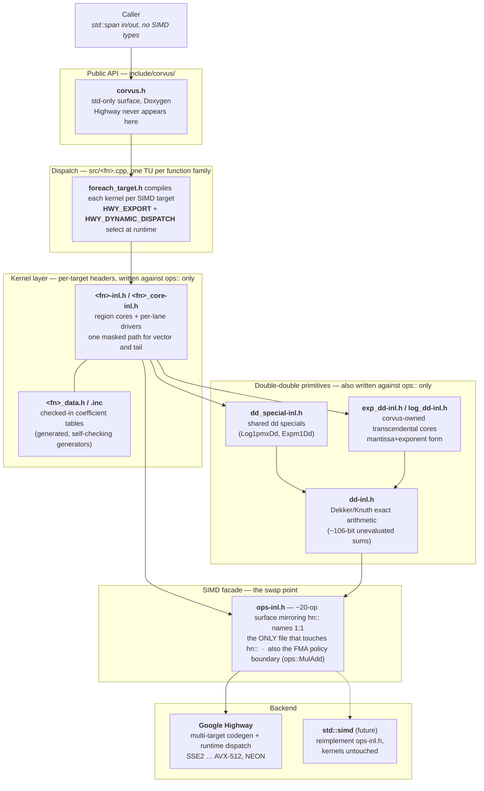

# corvus — Internal Layering

How a call travels from the public API down to SIMD instructions, and where
the Highway dependency is contained. Detail on hazards, doctrine, and the
build lives in the other docs; this page is the map.

## The layers

**Public API** (`include/corvus/corvus.h`) — the installed surface. Functions
take and return `std::span`; the header includes only the standard library.
No Highway type, macro, or header leaks through it.

**Dispatch** (`src/<fn>.cpp`) — one translation unit per function family; the
TU boundary is the sharing/dependency boundary (families consuming the same
cores share a TU with multiple `HWY_EXPORT`s). Each TU uses the Highway
`foreach_target.h` idiom to compile its kernels once per SIMD target, then an
`HWY_ONCE` section exports them and defines the public wrapper, which selects
the best target at runtime via `HWY_DYNAMIC_DISPATCH`.

**Kernels** (`src/<fn>-inl.h`, `src/<fn>_core-inl.h`) — the per-target
numerical code: region cores plus per-lane drivers, with vector body and
masked tail as one code path (no scalar libm fallback). Coefficient and
breakpoint tables are generated offline, checked in as `<fn>_data.*`, and
never derived at runtime. Kernels never allocate. Every kernel documents its
approximation source and error bound at the definition site.

**Double-double primitives** (`src/dd-inl.h`, `src/dd_special-inl.h`,
`src/exp_dd-inl.h`, `src/log_dd-inl.h`) — compensated arithmetic for
intermediates that need more than working precision: classical
Dekker/Knuth/Kahan exact-sum and exact-product algorithms (`dd-inl.h`),
shared dd special functions (`dd_special-inl.h`), and corvus-owned
transcendental cores kept in mantissa+exponent form so power-of-two scaling
rounds last. These sit beside the kernels, not below the facade: they are
written against `ops::` like every other kernel, so they ride along in the
backend swap for free.

**SIMD facade** (`src/ops-inl.h`) — a deliberately small op surface
(load/store, arithmetic, FMA, compares, masks, a few specials) whose names
mirror `hn::` 1:1. It is the only file in the project allowed to touch
`hn::`, which makes it the single swap point: migrating to `std::simd` means
reimplementing this one file, with kernels and dd primitives untouched.

**Backend** (Google Highway) — provides per-target code generation and
runtime CPU dispatch across SSE2 through AVX-512 and NEON. Pulled in via
`find_package` or pinned FetchContent; the pin moves only with a
revalidation pass.

## Boundary rules (enforced, not aspirational)

- `hn::` appears in `ops-inl.h` and nowhere else.
- Highway headers, types, and macros never appear under `include/corvus/`.
- Fusion is requested in source (`ops::MulAdd`); FP contraction is off
  project-wide, so the facade is also the FMA policy boundary.
- Exact dd residuals go through capability-guarded facade ops
  (`ops::ProdLow`), because Highway emulates `MulSub` on non-FMA targets in
  a way that would silently zero the residual.
